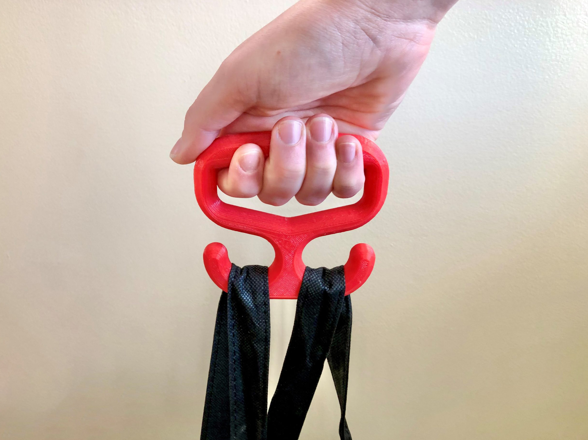

# Bag Carrier

## Overview

The bag carrier is a low-cost, 3D-printed handheld tool that distributes the weight of bags carried. This 3D Printed Assistive Device can assist people with arthritis or other disabilities to carry plastic bags and reusable bags. The bag handles can easily loop around the two curved hooks. The handle is rounded to allows users to comfortably grip the carrier.

[Makers Making Change Assistive Device Library Listing](https://www.makersmakingchange.com/s/product/bag-carrier/01tJR00000068yzYAA)

Last Updated: 2023-Mar-27

## Usage

This handle is used to assist in carrying plastic or reusable bags by offering a wider grip and more distributed loading. This handle can either be carried in hand or can be attached onto the side of a wheelchair. See the [User Guide](/Documentation/Bag_Carrier_User_Guide.pdf) for additional information.

## Build Instructions

All documentation, design files, and photos are contained within this repository. The [Maker Checklist]([/Documentation/Bag_Carrier_Maker_Checklist.pdf)) found in Documents will aid you in following the correct steps to build it yourself or work with a requester. 

### SKILLS REQUIRED
3D Printing

### TOOLS

3D Printer

### 3D PRINTING

The design is intended to print in PLA with no supports. 3D print STL's and instructions can be found on the GitHub page linked at the top of this project page.

## Sizing

There are small, medium, and large handles available for different sized hands. A printable [sizing guide](/Documentation/Bag_Carrier_Sizing_Guide.pdf) can be used to find the correct sizing for a user.

## Attribution
An original Bag Carrier was designed by Neil Squire Society / Makers Making Change. This is an updated, redsigned version of the original design.

### Contributors
 - Kerilyn Kennedy - Neil Squire Society / Makers Making Change
 - Jake McIvor - Neil Squire Society / Makers Making Change

---
<!-- ABOUT MMC START -->
## About Makers Making Change

Makers Making Change is a program of [Neil Squire](https://www.neilsquire.ca/), a Canadian non-profit that uses technology, knowledge, and passion to empower people with disabilities.

Makers Making Change leverages the capacity of community based Makers, Disability Professionals and Volunteers to develop and deliver affordable Open Source Assistive Technologies.

 - Website: [www.MakersMakingChange.com](https://www.makersmakingchange.com/)
 - GitHub: [makersmakingchange](https://github.com/makersmakingchange)
 - Bluesky: [@makersmakingchange.bsky.social](https://bsky.app/profile/makersmakingchange.bsky.social)
 - Instagram: [@makersmakingchange](https://www.instagram.com/makersmakingchange)
 - Facebook: [makersmakechange](https://www.facebook.com/makersmakechange)
 - LinkedIn: [Neil Squire Society](https://www.linkedin.com/company/neil-squire-society/)
 - Thingiverse: [makersmakingchange](https://www.thingiverse.com/makersmakingchange/about)
 - Printables: [MakersMakingChange](https://www.printables.com/@MakersMakingChange)

### Contact Us
For technical questions, to get involved, or to share your experience we encourage you to [visit our website](https://www.makersmakingchange.com/) or [contact us](https://www.makersmakingchange.com/s/contact).
<!-- ABOUT MMC END -->
